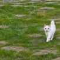

# ___***TrailBlazer***___

[](https://arxiv.org/abs/2401.00896)
[](https://hohonu-vicml.github.io/Trailblazer.Page/)
[](https://huggingface.co/spaces/hohonu-vicml/Trailblazer)
[](https://www.youtube.com/watch?v=kEN-32wN-xQ)
[](https://www.youtube.com/watch?v=P-PSkS7sNco)
[](https://hits.seeyoufarm.com)


This repository contains the implementation of the following paper: >
**TrailBlazer: Trajectory Control for Diffusion-Based Video Generation**<br> >
[Wan-Duo Kurt Ma](https://www.linkedin.com/in/kurt-ma/)<sup>1</sup>, [J.P.
Lewis](http://www.scribblethink.org/)<sup>2</sup>, [ W. Bastiaan
Kleijn](https://people.wgtn.ac.nz/bastiaan.kleijn)<sup>1</sup>,<br> Victoria
University of Wellington<sup>1</sup>, NVIDIA Research<sup>2</sup>

## :fire: Overview


Large text-to-video (T2V) models such as Sora have the potential to revolutionize visual effects and the creation of some types of movies. Current T2V models require tedious trial-and-error experimentation to achieve desired results, however. This motivates the search for methods to directly control desired attributes. In this work, we take a step toward this goal, introducing a method for high-level, temporally-coherent control over the basic trajectories and appearance of objects. Our algorithm, **TrailBlazer**, allows the general positions and (optionally) appearance of objects to controlled simply by keyframing approximate bounding boxes and (optionally) their corresponding prompts.

Importantly, our method does not require a pre-existing control video signal that already contains an accurate outline of the desired motion, yet the synthesized motion is surprisingly natural with emergent effects including perspective and movement toward the virtual camera as the box size increases. The method is efficient, making use of a pre-trained T2V model and requiring no training or fine-tuning, with negligible additional computation. Specifically, the bounding box controls are used as soft masks to guide manipulation of the self-attention and cross-attention modules in the video model. While our visual results are limited by those of the underlying model, the algorithm may generalize to future models that use standard self- and cross-attention components.

## :fire: Requirements

The codebase is tested under **NVIDIA GeForce RTX 3090** with the python library
**pytorch-2.1.2+cu121** and **diffusers-0.21.4**. We strongly recommend using a
specific version of Diffusers as it is continuously evolving. For PyTorch, you
could probably use other version under 2.x.x. With RTX 3090, I follow the
[post](https://discuss.pytorch.org/t/geforce-rtx-3090-with-cuda-capability-sm-86-is-not-compatible-with-the-current-pytorch-installation/123499)
to avoid the compatibility of sm_86 issue.

## :fire: Timeline

-   [2024/04/08]: Our new v2 preprint is now appeared on ArXiv (See [link](https://arxiv.org/abs/2401.00896))

-   [2024/03/23]: A new ArXiv update will be made.

-   [2024/03/22]: We release the multiple object synthesis (See
    [link](doc/Command.md#multiple-objects)), and the
    [Peekaboo](https://github.com/microsoft/Peekaboo) integration (See
    [link](doc/Peekaboo.md))

-   [2024/02/07]: The Gradio app is updated with better keyframe interface (See
    ([link](assets/gradio/gradio.jpg)))

-   [2024/02/06]: We now have Gradio web app at Huggingface Space!

-   [2024/02/01]: The official codebase released

-   [2024/01/03]: Paper released

-   [2023/12/31]: Paper submitted on ArXiv

## :fire: Usage

#### [Prepare]

First of all, download the pre-trained zeroscope model
([link](https://huggingface.co/cerspense/zeroscope_v2_576w)). You need to
register huggingface and make access token ([link](https://huggingface.co/))

```bash
git clone https://huggingface.co/cerspense/zeroscope_v2_576w ${MODEL_ROOT}/cerspense/zeroscope_v2_576w
```

where MODEL_ROOT is your preference that stores the model. Then, clone this Repo and cd into it:
```bash
git clone https://github.com/hohonu-vicml/Trailblazer && cd Trailbalzer
```

#### [Run it]

Our executable script is located in the "bin" folder, and the core module is
implemented in the "TrailBlazer" folder under the project root. Therefore, no
additional dependencies need to be added to PYTHONPATH; you can simply run the
command below :smirk: :

```bash
python bin/CmdTrailBlazer.py -mr ${MODEL_ROOT} --config config/XXXX.yaml  ## single experiment
python bin/CmdTrailBlazer.py -mr ${MODEL_ROOT} --config config/  ## run all yamls in a folder
```

:cupid:**UPDATE**:cupid:: TrailBlazer has just released Gradio app for the
alternative interface. Please checkout our documentation
([Gradio.md](doc/Gradio.md)) for more information. To run the app, simply run:

```bash
python bin/CmdGradio.py ${MODEL_ROOT} # no -mr here
```

When the shell environment variable ZEROSCOPE_MODEL_ROOT is specified, then you
can ignore the -mr (--model-root) argument above.

```bash
export ZEROSCOPE_MODEL_ROOT=/path/to/your/diffusion/root
# then you can ignore -mr term to simplify the command
python bin/CmdTrailBlazer.py --config config/XXXX.yaml
```

Please see [here](doc/Command.md) for more information about the command set
used in TrailBlazer.

#### [Config]

A list of config example files is stored in the `config` folder. Feel free to
run each of them and the result will be written in the `/tmp` folder. For more
information how to design the config file, and the visual result of each config.
Please visit [here](doc/Config.md) and [there](config/README.md) for more
details about config structure and the visual result, respectively.

## :fire: Contribution

This project is still working in progress, and there are numerous directions in
which it can be improved. Please don't hesitate to contact us if you are
interested, or feel free to make a pull request to strengthen the ideas.

## :fire: TODO

We regret to inform you that this repository is currently not fully accessible
to the public. Nevertheless, the majority of the core modules have been made
available (e.g., Single, Multiple objects synthesis, and Peekaboo comparison).
Our next release will include useful tools for measuring metrics.

## :fire: Fun


Poor cat: Someone, Stop me!



Am I a cat, or a dog...

Please inform us if you have generated any interesting videos!

## :fire: Citation

**TrailBlazer** is built on top of its mother project [**DirectedDiffusion**](https://hohonu-vicml.github.io/DirectedDiffusion.Page/), which recently published at AAAI2024. If you find our work useful for your research, please consider citing our paper.

   ```bibtex
   @article{ma2023trailblazer,
       title={TrailBlazer: Trajectory Control for Diffusion-Based Video Generation},
       author={Wan-Duo Kurt Ma and J. P. Lewis and W. Bastiaan Kleijn},
       year={2023},
       eprint={2401.00896},
       archivePrefix={arXiv},
       primaryClass={cs.CV}
   }

   @article{ma2023directed,
       title={Directed Diffusion: Direct Control of Object Placement through Attention Guidance},
       author={Wan-Duo Kurt Ma and J. P. Lewis and Avisek Lahiri and Thomas Leung and W. Bastiaan Kleijn},
       year={2023},
       eprint={2302.13153},
       archivePrefix={arXiv},
       primaryClass={cs.CV}
   }
   ```
