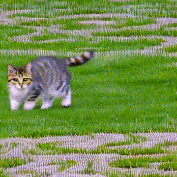
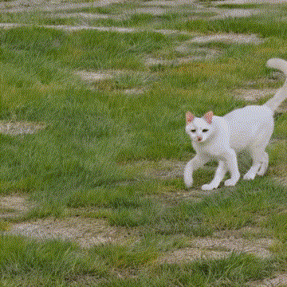

# ___***Trailblazer***___

[](https://arxiv.org/abs/2401.00896)
[](https://hohonu-vicml.github.io/Trailblazer.Page/)
[](https://huggingface.co/spaces/hohonu-vicml/Trailblazer)
[](https://www.youtube.com/watch?v=kEN-32wN-xQ)
[](https://www.youtube.com/watch?v=P-PSkS7sNco)
[](https://hits.seeyoufarm.com)


This repository contains the implementation of the following paper:
> **Trajectory Control for Diffusion-Based Video Generation**<br>
> [Wan-Duo Kurt Ma](https://www.linkedin.com/in/kurt-ma/)<sup>1</sup>, [J.P. Lewis](http://www.scribblethink.org/)<sup>2</sup>, [ W. Bastiaan Kleijn](https://people.wgtn.ac.nz/bastiaan.kleijn)<sup>1</sup>,<br>
Victoria University of Wellington<sup>1</sup>, NVIDIA Research<sup>2</sup>

## :fire: Overview


**TrailBlazer** focuses on enhancing controllability in video synthesis by employing straightforward bounding boxes to guide the subject in various ways, all without the need for neural network training, finetuning, optimization at inference time, or the use of pre-existing videos. Our algorithm is constructed upon a pre-trained (T2V) model, and easy to implement. The subject is directed by a bounding box through the proposed spatial and temporal attention map editing. Moreover, we introduce the concept of keyframing, allowing the subject trajectory and overall appearance to be guided by both a moving bounding box and corresponding prompts, without the need to provide a detailed mask. The method is efficient, with negligible additional computation relative to the underlying pre-trained model. Despite the simplicity of the bounding box guidance, the resulting motion is surprisingly natural, with emergent effects including perspective and movement toward the virtual camera as the box size increases.

## :fire: Requirements

The codebase is tested under **NVIDIA GeForce RTX 3090** with the python library **pytorch-2.1.2+cu121** and **diffusers-0.21.4**. We strongly recommend using a specific version of Diffusers as it is continuously evolving. For PyTorch, you could probably use other version under 2.x.x. With RTX 3090, I follow the [post](https://discuss.pytorch.org/t/geforce-rtx-3090-with-cuda-capability-sm-86-is-not-compatible-with-the-current-pytorch-installation/123499) to avoid the compatibility of sm_86 issue.

## :fire: Timeline

-   [2024/02/06]: We now have Gradio web app at HF(:hugs:) Space! Please check it out!
-   [2024/02/01]: The official codebase released
-   [2024/01/03]: Paper released
-   [2023/12/31]: Paper submitted on ArXiv

## :fire: Usage

#### [Prepare]

First of all, download the pre-trained zeroscope model ([link](https://huggingface.co/cerspense/zeroscope_v2_576w)). You need to register huggingface and make access token ([link](https://huggingface.co/))
```bash
git clone https://huggingface.co/cerspense/zeroscope_v2_576w ${MODEL_ROOT}/cerspense/zeroscope_v2_576w
```

where MODEL_ROOT is your preference that stores the model. Then, clone this Repo and cd into it:
```bash
git clone https://github.com/hohonu-vicml/Trailblazer && cd Trailbalzer
```

#### [Run it]

Our executable script is located in the "bin" folder, and the core module is implemented in the "TrailBlazer" folder under the project root. Therefore, no additional dependencies need to be added to PYTHONPATH; you can simply run the command below :smirk: :
```bash
python bin/CmdTrailBlazer.py -mr ${MODEL_ROOT} --config config/XXXX.yaml  ## single experiment
python bin/CmdTrailBlazer.py -mr ${MODEL_ROOT} --config config/  ## run all yamls in a folder
```

:cupid:**UPDATE**:cupid:: TrailBlazer has just released Gradio app for the alternative interface. Please checkout our documentation ([Gradio.md](doc/Gradio.md)) for more information. To run the app, simply run:
```bash
python bin/CmdGradio.py ${MODEL_ROOT} # no -mr here
```

#### [Config]

A list of config example files is stored in the `config` folder. Feel free to run each of them and the result will be written in the `/tmp` folder. For more information how to design the config file, and the visual result of each config. Please visit [here](config/README.md).

## :fire: Contribution

This project is still working in progress, and there are numerous directions in which it can be improved. Please don't hesitate to contact us if you are interested, or feel free to make a pull request to strengthen the ideas.

## :fire: TODO

We apologize this repository is currently not fully public. Currently, we only release the core methods of a single subject synthesis. We will progressively make the multiple subjects and Gradio demo within next two weeks. Stay tuned! (again!)

## :fire: Fun

 Poor cat: Someone, Stop me!

 TrailBlazer can also make subject deformation!


## :fire: Citation

**TrailBlazer** is built on top of its mother project [**DirectedDiffusion**](https://hohonu-vicml.github.io/DirectedDiffusion.Page/), which recently published at AAAI2024. If you find our work useful for your research, please consider citing our paper.

   ```bibtex
   @article{ma2023trailblazer,
       title={TrailBlazer: Trajectory Control for Diffusion-Based Video Generation},
       author={Wan-Duo Kurt Ma and J. P. Lewis and W. Bastiaan Kleijn},
       year={2023},
       eprint={2401.00896},
       archivePrefix={arXiv},
       primaryClass={cs.CV}
   }

   @article{ma2023directed,
       title={Directed Diffusion: Direct Control of Object Placement through Attention Guidance},
       author={Wan-Duo Kurt Ma and J. P. Lewis and Avisek Lahiri and Thomas Leung and W. Bastiaan Kleijn},
       year={2023},
       eprint={2302.13153},
       archivePrefix={arXiv},
       primaryClass={cs.CV}
   }
   ```
