# TrailBlazer: Config

Here we illustrate how to make your own config under the current implementation.
Please use the following command to run our TrailBlazer:

```bash
python bin/CmdTrailBlazer.py --config ${YOUR_CONFIG_FILEPATH} -mr ${YOUR_MODEL_ROOT}
e.g., python bin/CmdTrailBlazer.py --config config/R2L-fish.yaml -mr ${YOUR_MODEL_ROOT}
```

For your convenience, you could run the following command to get the results from all config yamls in the given folder:
```bash
python bin/CmdTrailBlazer.py --config ${YOUR_CONFIG_FOLDER} -mr ${YOUR_MODEL_ROOT}
# say, you want to execute all yaml files in the provided config folder
e.g., python bin/CmdTrailBlazer.py --config ./config -mr ${YOUR_MODEL_ROOT}
```

(TODO: We will futher update how to run the scene compositing
with multiple objects in within a few weeks. We appreciate your patience.)

## Structure

The following example pseudo config covers the needs to run our TrailBlazer for
single object.

```yaml**
keyframe:
- bbox_ratios:
  - 0.0               # b_left: float
  - 0.35              # b_top: float
  - 0.4               # b_right: float
  - 0.65              # b_bottom: float
  frame: 0            # int
  prompt: A cat is running on the grass # str
- bbox_ratios:
  - 0.6
  - 0.35
  - 1.0
  - 0.65
  frame: 24
  prompt: A cat is running on the grass # str
num_dd_spatial_steps: 5
num_dd_temporal_steps: 5
seed: 20
spatial_strengthen_scale: 0.15
spatial_weaken_scale: 0.001
temp_strengthen_scale: 0.15
temp_weaken_scale: 0.001
token_inds:
- 1
- 2
trailing_length: 15
```

Some requirements:
- At least two keyframes are required for the initial and the end frame. The initial frame index must be 0.
- It's recommend to set the end frame at 24 as this is how ZeroScope model was trained (See [here](https://zeroscope.replicate.dev/)).
- Each keyframe contains bbox_ratios, frame, and prompt. The consistency between
  each component should be maintained conceptually by user. Some violated
  examples can be found below in Omg category.
- In our experience, the trailing_length is a parameter that needs frequent adjustment for optimal results.
- The tuple of the floats in bbox should be reasonably specified. E.g., b_left <
  b_right, b_top < b_bottom in opencv style.


## Result per config

This codebase is slightly refactored, and for some reason it affects the results different from our youtube video. We'll check if anything goes wrong in the following days.

- **L2R**: Standard test to move subject from left to right.

**L2R-fish.yaml**

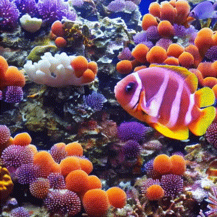

**L2R-horse.yaml**

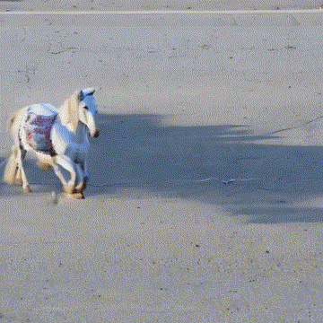

- **R2L**: Standard test to move subject from right to left.

**R2L-fish.yaml**

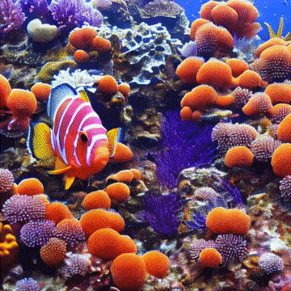

**R2L-horse.yaml**

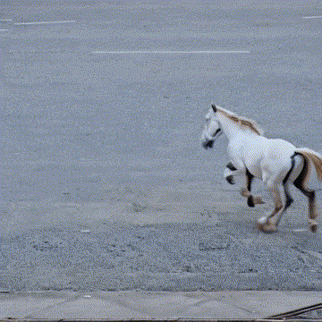

- **2ndKey**: To make varied speed by adjusting the middle key timing.

**2ndKey-astronaut.0001.yaml**

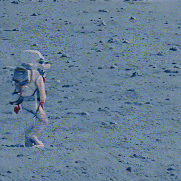

**2ndKey-astronaut.0002.yaml**

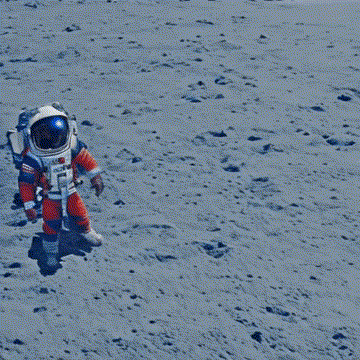

**2ndKey-astronaut.0003.yaml**

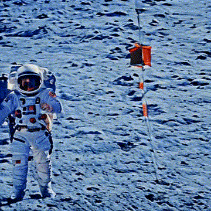

**2ndKey-astronaut.0004.yaml**

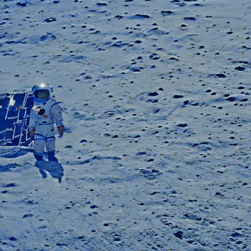

- **BR2TL**: To make the subject from bottom right (BR) to top left (TL).

**BR2TL-fish.yaml**

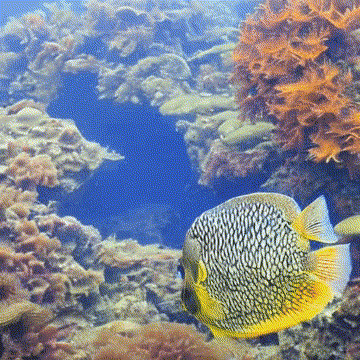

**BR2TL-tiger.yaml**

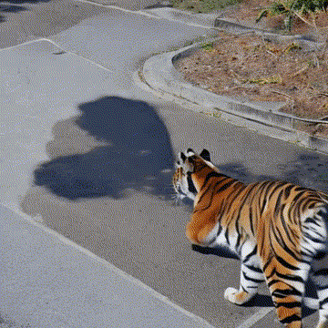

- **TL2BR**: To make the subject from top left (TL) to bottom right (BR).

**TL2BR-fish.yaml**

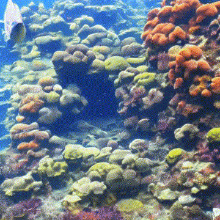

**TL2BR-tiger.yaml**

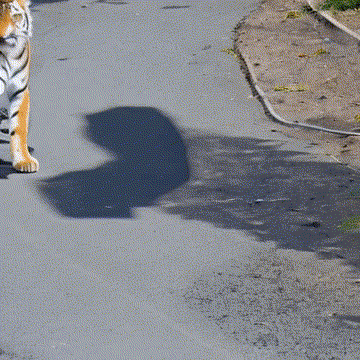

- **FNF-fish**: Two comparison on changing or not changing the bbox size of fish to emulate the perspective view changes.

**Perspective-fish.0001.yaml**

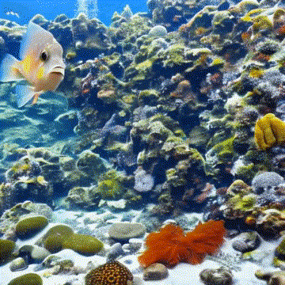

**Perspective-fish.0002.yaml**

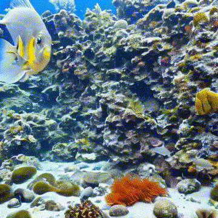

- **Speed-cat**: To see different number of keyframes that controls the poor cat.

**Speed-cat.0001.yaml**

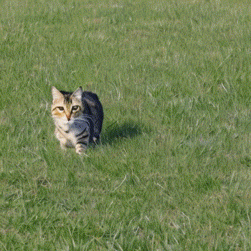

**Speed-cat.0002.yaml**

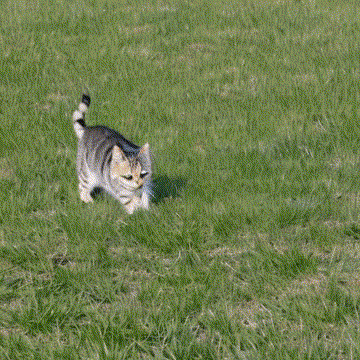

**Speed-cat.0003.yaml**

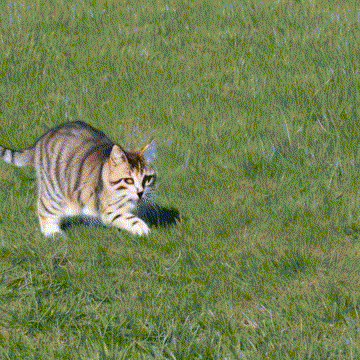

**Speed-cat.0004.yaml**


- **Speed-{animal}.0004**: To see how other animal runs back-and-forth.

**Speed-dog.0004.yaml**

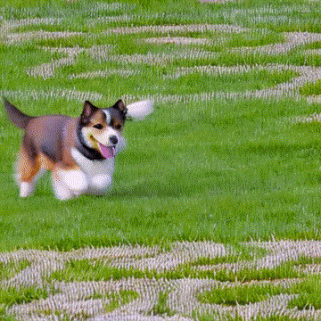

**Speed-horse.0004.yaml**

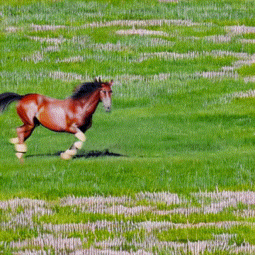

**Speed-tiger.0004.yaml**

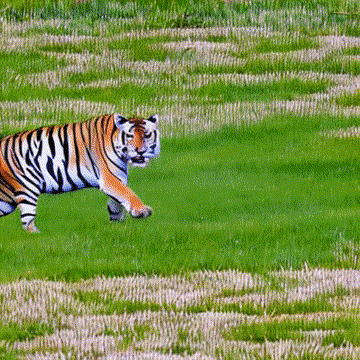

**Speed-reindeer.0004.yaml**

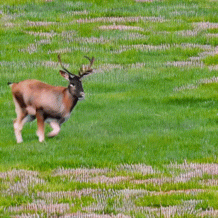

- **Omg**: The configs that defy common sense can lead to unexpected and
  potentially problematic behavior. On my god.

**Omg-CatDog.yaml**: Consistency in the subject is crucial. You will witness how a cat transforms into a dog if the subject prompt word is inconsistent.


**Omg-IrrPath.yaml**: It is advised to avoid using a discontinuous keyframe bbox. In such a case, you will observe three different horses appearing from the left.

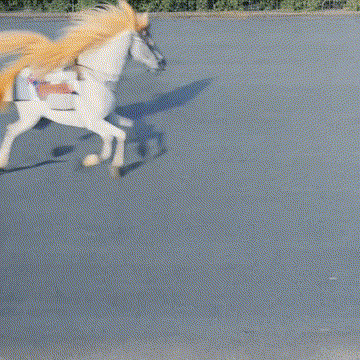


**Omg-Speed-sloth.0004.yaml**: The sloth, tortoise, and snail are recognized for their slow movements. Applying fast keyframing to these creatures may yield unexpected results.

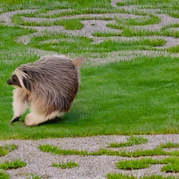

**Omg-Speed-tortoise.0004.yaml**: I believe master roshi (Dragon ball) is hiding in the shell.

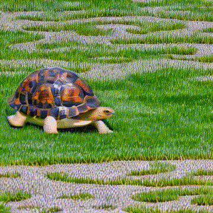

**Omg-Speed-snail.0004.yaml**: It feels like the snail is rolling without using his body.

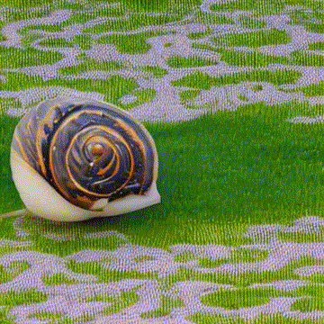
