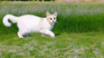
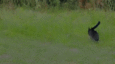
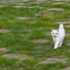
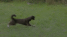

# TrailBlazer: Config

Below, we display the icon of the result, which has been reduced to 20% of the
original resolution to maintain a small repository size.

## Main - TrailBlazer

### Fig.5 Main result: Rigid bbox moving from left to right

Main/RigidMoving-Astronaut.yaml

Main/RigidMoving-Bee.yaml

Main/RigidMoving-Cat.yaml

Main/RigidMoving-Clownfish.yaml

### Fig.6 Main result: Dynamic moving bbox

Main/PerspTL2BR-Tiger.yaml

Main/PerspBR2TL-Tiger.yaml

Main/SpeedKeys-Cat.yaml

## Main - Peekaboo

### Fig.5 Main result: Rigid bbox moving from left to right

Main/RigidMoving-Astronaut.yaml

Main/RigidMoving-Bee.yaml

Main/RigidMoving-Cat.yaml

Main/RigidMoving-Clownfish.yaml

### Fig.6 Main result: Dynamic moving bbox

Main/PerspTL2BR-Tiger.yaml

Main/PerspBR2TL-Tiger.yaml

Main/SpeedKeys-Cat.yaml

## Main - Text2Video-Zero

### Fig.5 Main result: Rigid bbox moving from left to right

Main/RigidMoving-Astronaut.yaml

Main/RigidMoving-Bee.yaml

Main/RigidMoving-Cat.yaml

Main/RigidMoving-Clownfish.yaml

## Morphin

We refrain from discussing the results in the paper, but we provide a glimpse of
what we can experiment with.

Morphin/Tiger2Elephant.yaml

Morphin/Parrot2Penguin.yaml

Morphin/Cat2Fish.yaml

Morphin/Cat2Dog.yaml

## Multi

Multi/MultiSubject-Cat.yaml

Multi/MultiSubject-Dog.yaml

Multi/MultiSubjects.yaml

## (Supp Fig.4) Extreme comparison - TrailBlazer

Peekaboo/2ndKeyFast.yaml

Peekaboo/ChangingFish.yaml

Peekaboo/CrazyHorse.yaml

Peekaboo/FastDog.yaml

Peekaboo/TinyFish.yaml

## (Supp Fig.4) Extreme comparison - Peekaboo

Peekaboo/2ndKeyFast.yaml

Peekaboo/ChangingFish.yaml

Peekaboo/CrazyHorse.yaml

Peekaboo/FastDog.yaml

Peekaboo/TinyFish.yaml

