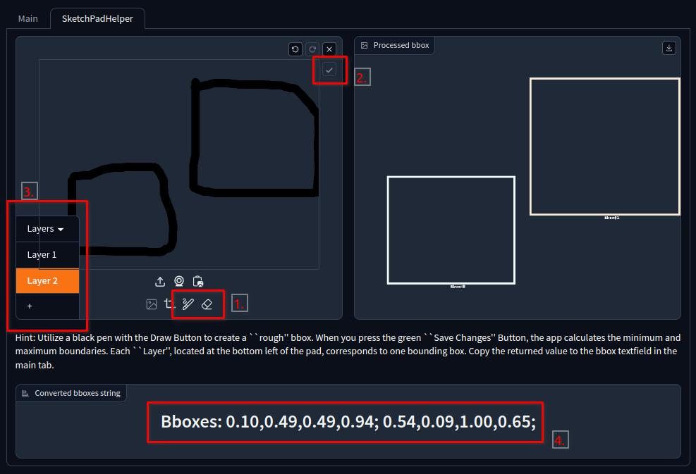

# Gradio App

TrailBlazer provides the web app on Huggingface Space using Gradio ([link](https://huggingface.co/spaces/hohonu-vicml/Trailblazer)). The following screenshot is the overview of the page:


Alternatively, you can execute the app through terminal, then run the app at your local browser with the provided URL (e.g., http://127.0.0.1:xxxx)

```bash
python bin/CmdGradio.py ${MODEL_ROOT}
```


We also offer a handy tool for constructing bounding boxes through drawing. You can find it on the second tab called "SketchPadHelper." To use it, simply choose the pen/eraser (1.) to draw a single box on the canvas. Afterward, press the green check button (2.), which default by gray in the screenshot. Then TrailBlazer will process it, displaying the bbox string in (4.) and a preview in the next canvas.

Please keep in mind that our implementation of bbox is linked to layering located at (3.). If you have multiple bboxes to process, you can press the + sign, select the new layer, and then start drawing.



Similar to GLIGEN(CVPR2023), that they noticed that Gradio doesn't have feature to make bounding box in a convenient way (See their doc [here](https://github.com/gligen/GLIGEN/tree/master/demo#question-how-do-you-draw-bounding-boxes-using-gradio-sketchpad)). Nevertheless, the latest Gradio version 4.x.x is incompatible with their implementation. We adopt a similar approach that examines the minimum and maximum values of the user's drawing on each layer to generate bounding box information.
